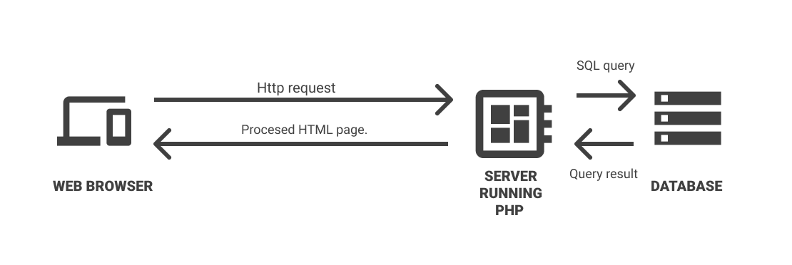

# PHP -> (Basically) The HTML generator.

Php generates HTML, that's the point.
Basic php structure be like.

## Inside oldie backend minds..
The php is processed and given as HTML page to the client.

## Diving into the code
Basic code piece to explain these concepts:

We have code **A**: 
```
<?php
  require_once "./B.php";
  include_once "./C.php";

  echo "<h1>Hi $user</h1>";
  foreach($books as $book)
    echo "<li>$book</li>";
?>
```

This code runs the following output 

<hr>
  <h1>HI JUAN!!!</h1>
  <li>Lord of the rings</li>
  <li>Harry Potter</li>
<hr>

## HOW IS THIS POSSIBLE?
Okay, It's possible because we **include/require** other php files in it.
Those php files **B** and **C**:

_B.php_
```
  <?php
    $user = "JUAN";
  ?>
```

_C.php_
```
  <?php
    $books = ["Lord of the rings","Harry Potter"];
  ?>
```
