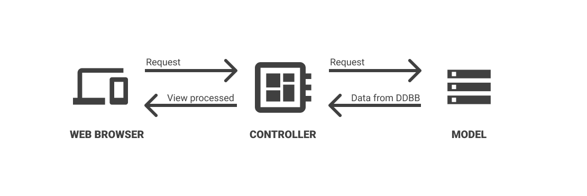

# CodeIgniter - MVC meets php

Okay let's understand Model - View - Controller paradigm.



**Controller**
> Controller does redirecting / logic / processing stuff.

**Model**
> Model gets data from database organized. 

**View**
> View shows data in a pretty way :)

## Summary
> _That's all. Simple, easy._

# Php implementation >> CodeIgniter
Php implements this with CodeIgniter framework. 

## Structure

```

  /__
     |_ Config
     |  |_ Autoload.php       # Loading thing at start
     |  |_ Database.php       # Database configurations 
     |  |_ ...
     |
     |_ Models                      # Your models
     |  |_ userModel.php
     |  |_ enterpriseModel.php
     |  |_ ...
     |
     |_ Controllers                 # Your controllers
     |  |_ profileController.php
     |  |_ productRegisterController.php
     |  |_ ...
     |
     |_ Views                       # Your views
        |_ loginView.php
        |_ RegisterView.php
        |_ ProductView.php
        |_ ...
  
```
